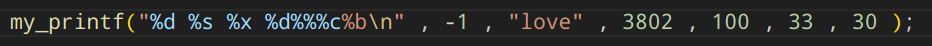

# Printf
## Задача:
Написать свою версию стандартной функции printf языка C, реализовав некоторые ее спецификаторы.
\
Код писался на ассемблерном языке NASM.
## Сборка
Создание объектника ассемблерной программы.

` nasm -f elf64  -F dwarf  my_printf.asm -o my_printf.o `

Создание объектника программы на C.

` g++  test.cpp -c -o      test.o -fno-pie `

Линковка двух объектников.

 ` g++ test.o my_printf.o -o lox -no-pie `

## Реализованные спецификаторы
 | Формат   | Описание                                                       | Пример                | Результат         |
|----------|----------------------------------------------------------------|-----------------------|-------------------|
| `%%`     | Печатает символ `%`                                            | `printf("%%");`       | `%`               |
| `%c`     | Печатает один символ (байт), переданный в аргументе            | `printf("%c", 'X');`  | `X`               |
| `%s`     | Печатает строку, адрес которой передан в аргументе             | `printf("%s", "Text");` | `Text`           |
| `%b`     | Печатает значение аргумента в двоичной форме                  | `printf("%b", 42);`    | `101010`             |
| `%d`     | Печатает значение аргумента в формате знакового целого        | `printf("%d", 42);`  | `42`             |
| `%o`     | Печатает значение аргумента в восьмеричной форме              | `printf("%o", 42);`    | `52`              |
| `%x`     | Печатает значение аргумента в шестнадцатеричной форме         | `printf("%x", 42);`  | `2a`              |

### Пример работы

### Буферизация
Для вывода в консоль использовалась буферицазция, что значительно ускоряет работу программы.

### Расширяемость спецификаторов
Для обработки спецификаторов использовалась jmp-таблица, что сильно упрощает добаление новых спецификаторов.

### Скорость работы
Было измерено время работы обоих функций на 1000 повторений, было получено что стандартный printf занимает больше времени примерно на $` 2*(10)^5 `$ секунд. Можно полагать, что my_printf работает быстрее из-за отсутствия комплексности.

